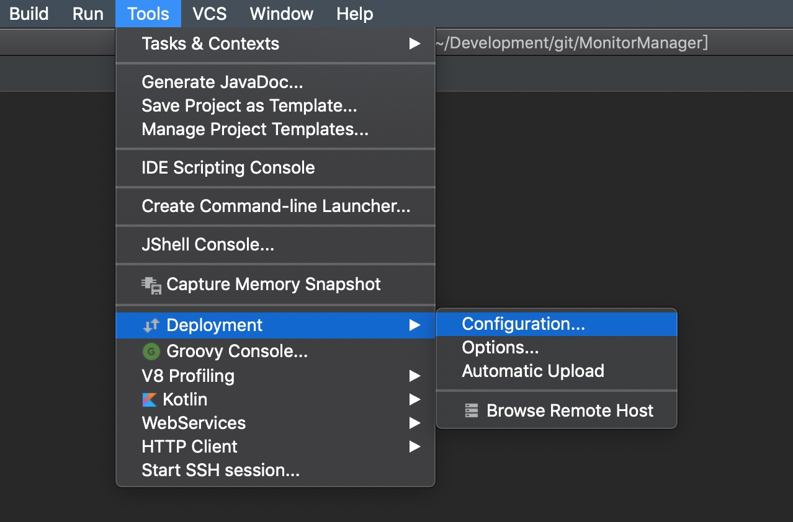
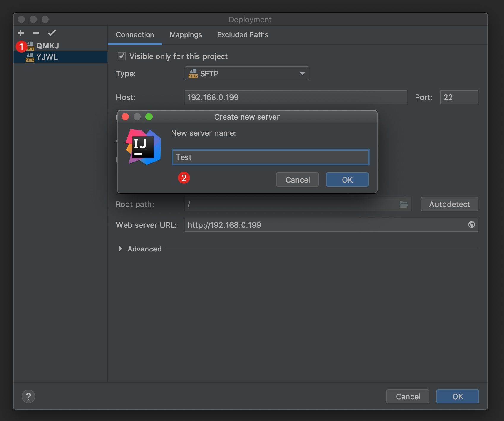
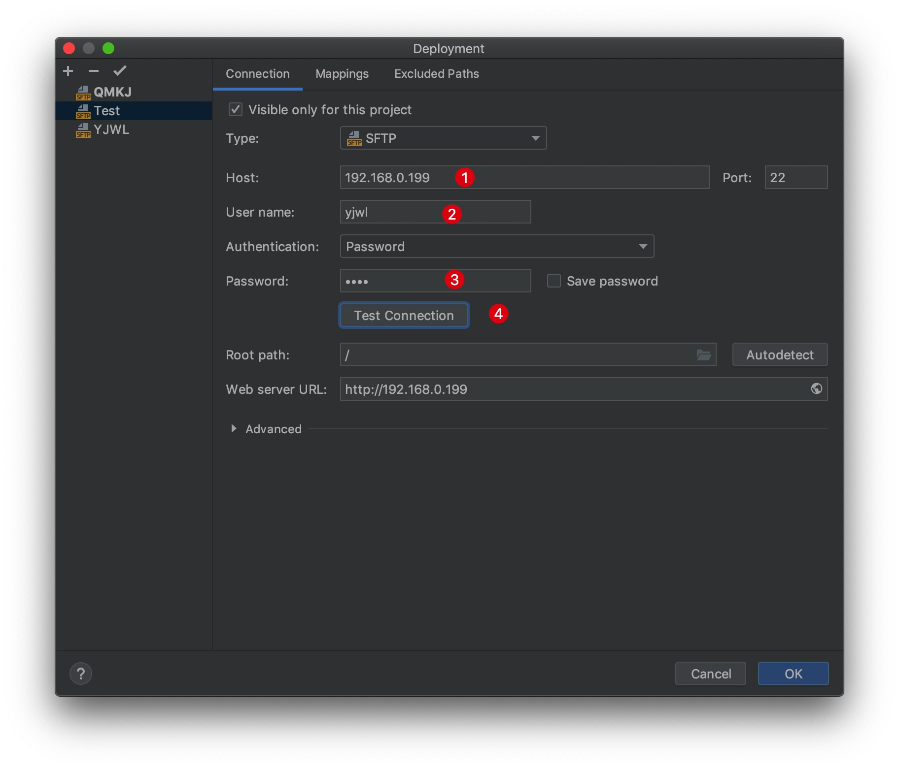
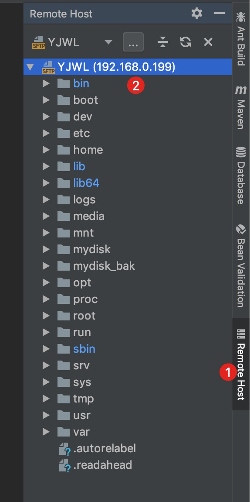
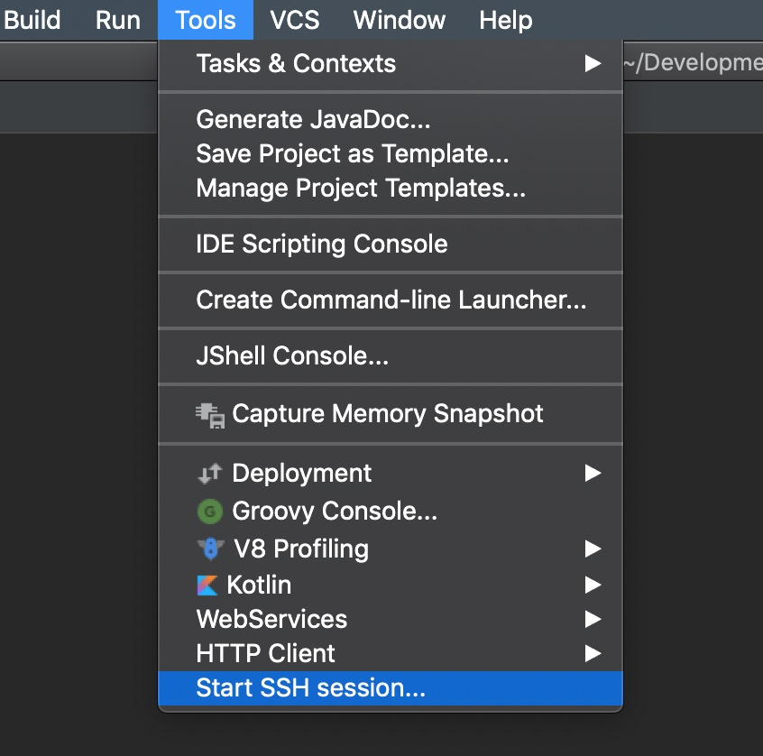
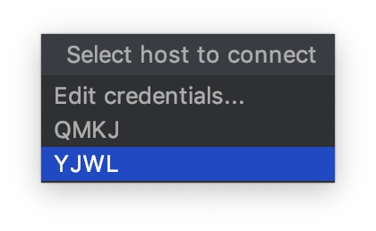
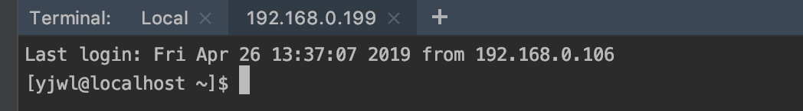
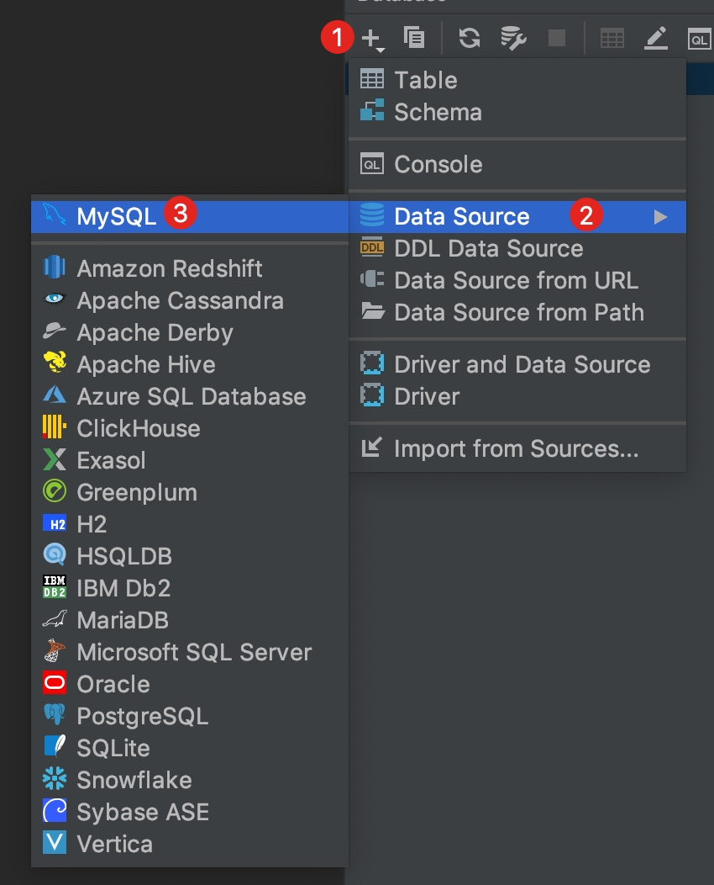
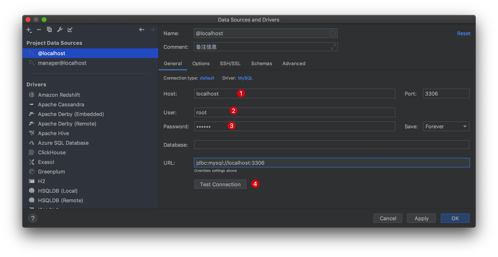

# 如何使用IDEA进行ftp或者ssh连接服务器

## 后端开发新利器

Web开发难免需要数据库和服务器，所以以下我们解决一个后端开发的需求：如何高效连接数据库和服务器

### 免去安装各种前端

我过去开发后端都必须安装一个顺手的前端软件进行连接数据库或者服务器，推荐一下用户的软件：

mysql连接方案

1. Navicat
2. MySQL Workbench
3. PhpMyAdmin
4. Sequel Pro(Mac)

ftp或ssh连接方案

1. FileZilla
2. xShell

但是找个跨平台的又顺手的就不太容易。

### 新的解决方案

使用IDEA自带功能，IDEA本来就是跨平台的IDE，再加上配置可以导出，这样我们就找到一个通用性的解决方案，当然如果你是运维，对某一个功能需求比较强烈，还是可以使用更专业的软件。

1. Tools->Deployment->Configuration进行配置

   

2. ①增加按钮，输入一个服务器名称②

   

3. 如有服务器地址①，用户名②，密码③，然后测试连接④，成功后点击OK

   

4. 就能在Remote Host视图中看到文件系统了

    

5. 演示ssh连接方式，Tools->Start SSH session...

    

6. 选择一个session连接。

   

7. 最终效果

   

8. 连接mysql方式

    

9. 接下来完善连接信息，服务器地址①，用户名②，密码③，测试连接④

    